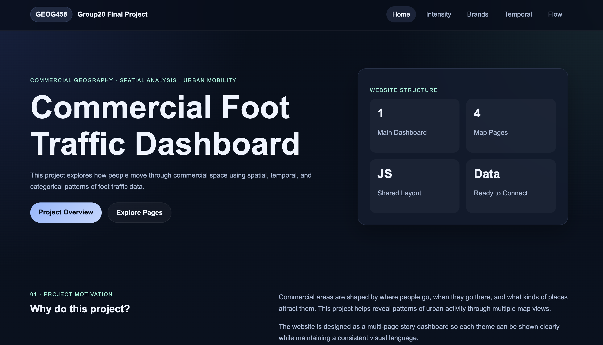
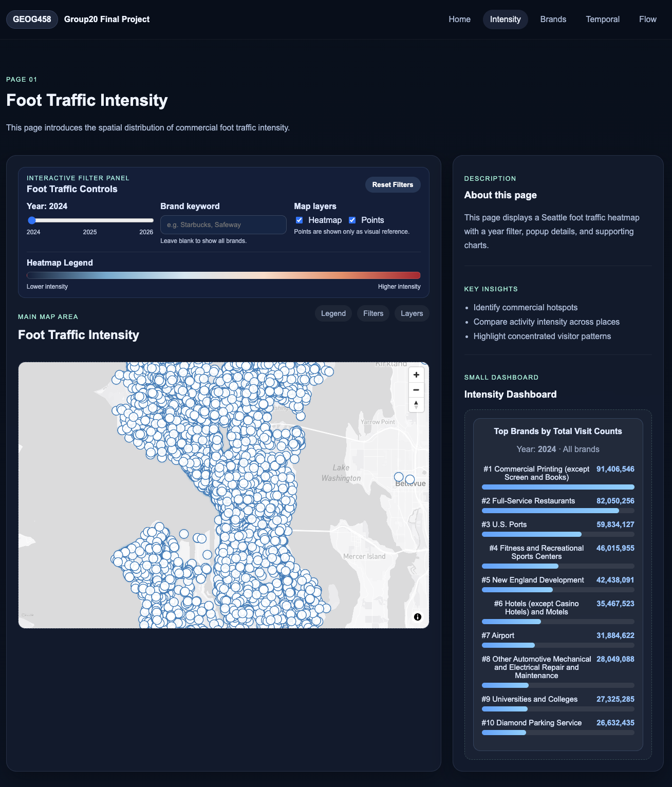
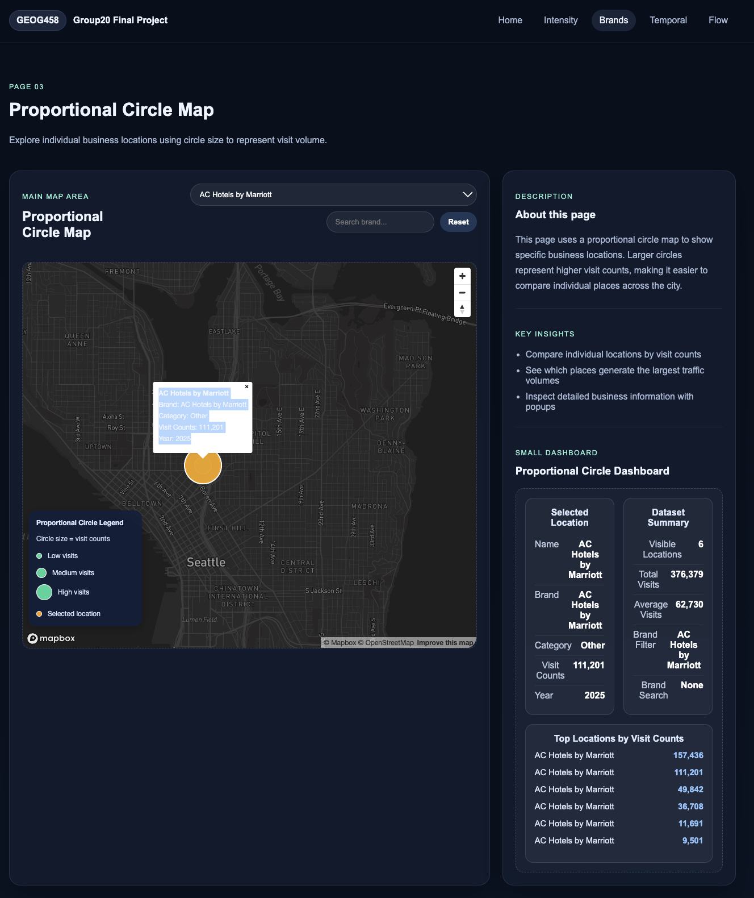

# GEOG458_Group20_final_project
# Commercial Foot Traffic Analysis

An interactive geospatial dashboard analyzing commercial mobility patterns using large-scale foot traffic data.

---

## 1. Project Overview

### Project Description
This project analyzes large-scale commercial foot traffic data to identify and visualize high-activity urban areas. Using Advan’s Neighborhood Patterns Plus dataset, we develop an interactive dashboard that highlights spatial and temporal patterns in mobility across different census block groups (CBGs).

Through choropleth mapping and dynamic filtering, users can explore how foot traffic varies by location, time of day (e.g., breakfast, lunch, dinner), and day of the week (weekday vs. weekend). The project also incorporates origin-destination flow maps and demographic visualizations to provide deeper insights into how people move through commercial spaces.

By transforming complex mobility datasets into intuitive visualizations, this project helps users better understand how cities function dynamically rather than relying solely on static geographic data.

### Target Audience
This project is designed for a range of users who benefit from understanding spatial patterns in human activity:

- Urban planners and city officials analyzing infrastructure needs
- Retail and real estate developers making site selection decisions
- Small business owners identifying high-traffic locations
- Researchers and students exploring digital geography and mobility data

---
SECTION 2

---

# Page 1: Foot Traffic Intensity Page
## Purpose

The Foot Traffic Intensity page is designed to show where foot traffic is concentrated across the city. It focuses on spatial density rather than individual store inspection. This page is useful for identifying high-intensity commercial areas and comparing how visible traffic patterns change by year or brand keyword. :contentReference[oaicite:2]{index=2}

## Main Visualization

The main map uses a heatmap layer to represent the density and magnitude of visit counts. A point layer is also included as a visual reference, but individual points are not clickable on this page. The design choice keeps the page focused on large-scale intensity patterns instead of location-level popups. :contentReference[oaicite:3]{index=3} :contentReference[oaicite:4]{index=4}

## Interactive Controls

This page includes a control panel above the map. The user can:

- change the year with a year slider
- search for a brand using a keyword input
- toggle the heatmap layer on or off
- toggle the point reference layer on or off
- reset all filters with a reset button

These controls allow the map and dashboard to update dynamically based on the selected filters.

## Legend

A heatmap legend is included in the control panel. It uses a color gradient from lower intensity to higher intensity so users can interpret how hotspot colors relate to foot traffic concentration.

## Dashboard

The dashboard on this page only keeps the ranking component. It summarizes the top brands by total visit counts after filters are applied. This means the ranking updates dynamically when the user changes the year or enters a brand keyword.

## Data Processing Logic

This page reads from the cleaned GeoJSON file:

`../data/seattle_agg_2024_2026_full_clean.geojson`

The script standardizes field access by checking multiple possible property names such as `brand`, `Brand`, `BRAND`, `visit_counts`, `VISIT_COUNTS`, `year`, and `YEAR`. This makes the page more robust when working with slightly inconsistent field names in the dataset.

## User Experience Notes

This page is intended for pattern exploration at a city scale. It helps users answer questions such as:

- Where are the strongest foot traffic hotspots?
- How do intensity patterns change across years?
- Which brands appear most strongly in the filtered results?

Because the map does not support clicking individual points, the emphasis stays on broader spatial intensity and brand ranking rather than detailed store inspection.

---

# Page 2: Category Page (Proportional Circle Map)

## Purpose

The Category page has been redesigned as a proportional circle map. Instead of using category blocks or a previous categorical view, this page now visualizes individual locations as circles whose size reflects visit counts. This makes it easier to compare specific places and inspect detailed location information.

## Main Visualization

The map displays point locations as proportional circles. Larger circles represent higher visit counts, while smaller circles represent lower visit counts. This makes the map useful for direct comparison between individual stores or destinations.

## Interactive Controls

The controls are placed in the shared toolbar area created by the main template. The user can:

- choose a brand from a dropdown menu
- search brands with a text input
- reset the filters with a reset button

These controls update both the map and the dashboard.

## Legend

A proportional circle legend is placed on the map. It explains that circle size represents visit counts and also shows a separate symbol for the currently selected location. This helps users understand both the data scaling and the click-selection behavior.

## Click Interaction

Unlike the intensity page, this page supports clicking circles. When the user clicks a location:

- the selected circle is highlighted
- a popup appears with location details
- the side dashboard updates with the selected location information

This interaction makes the page suitable for more detailed inspection of specific locations.{index=18}

## Dashboard

The dashboard includes three main parts:

### Selected Location
This section shows detailed information for the clicked point, including location name, brand, category, visit counts, and year. If no point is selected, the page prompts the user to click a circle.

### Dataset Summary
This section summarizes the currently visible filtered dataset, including:

- visible locations
- total visits
- average visits
- selected brand filter
- brand search keyword

This helps users understand the overall filtered result, not just one selected point. :contentReference[oaicite:20]{index=20}

### Top Locations by Visit Counts
This section ranks the top visible locations according to visit counts. It updates dynamically when the brand dropdown or search filter changes.

## Data Processing Logic

This page also loads data from:

`../data/seattle_agg_2024_2026_full_clean.geojson`

The script filters the dataset to point geometries only and assigns feature IDs where necessary. It also uses helper functions to safely read fields such as brand, category, visit counts, year, and location name from multiple possible property names.

## Map Behavior

The page automatically zooms to the filtered results so users can focus on the currently relevant data. After each filter update, the selected circle layer is reset, the dashboard is rebuilt, and the map is resized if needed. This improves the responsiveness of the page and keeps the visual state synchronized with the dashboard.{index=24}

## User Experience Notes

This page is intended for location-level comparison and inspection. It helps users answer questions such as:

- Which locations have the highest visit counts?
- How does one brand compare across locations?
- What details belong to a selected site?

Compared with the heatmap page, this page is better for detailed exploration of individual destinations.

---

## 3. Limitations and Future Improvements

### Data Limitations

- **Aggregation at CBG level**: Data is aggregated to protect privacy, which reduces spatial precision and may mask smaller-scale patterns
- **Sampling bias**: The dataset is based on mobile device activity and may underrepresent certain populations
- **Temporal limitations**: Data reflects specific time periods and may not capture long-term or seasonal trends
- **Estimated demographics**: Demographic characteristics are inferred and may not fully reflect actual populations

---

### Technical Limitations

- **Performance constraints**: Large geospatial datasets and flow maps can affect loading speed and responsiveness
- **Static data usage**: The dashboard does not incorporate real-time data
- **Limited analytical depth**: Advanced spatial statistical methods (e.g., hotspot analysis) are not fully implemented
- **Simplified interface**: Some features and interactions are limited due to development time constraints

---

### Future Improvements

- Integrate real-time or frequently updated mobility data
- Apply advanced spatial analysis techniques (e.g., hotspot analysis, clustering)
- Improve UI/UX with smoother interactions and more intuitive controls
- Add predictive modeling to forecast foot traffic trends
- Incorporate additional datasets (e.g., business types, zoning, transportation networks)
- Expand scalability to support multiple cities or regions
